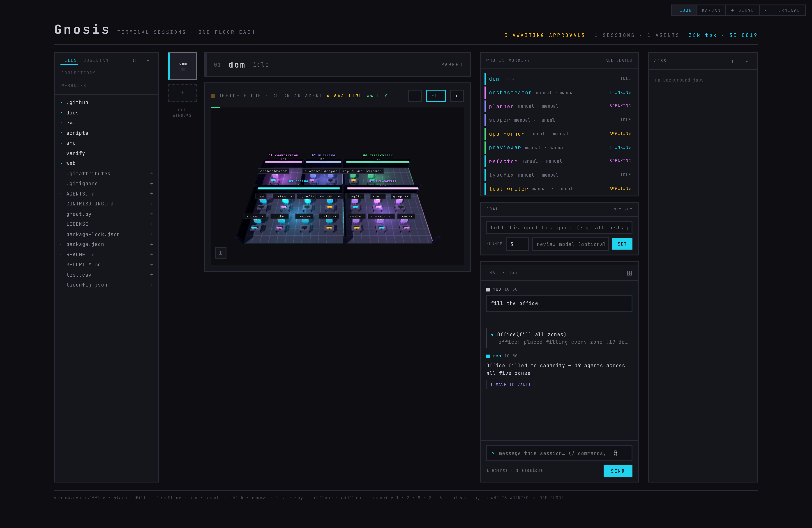
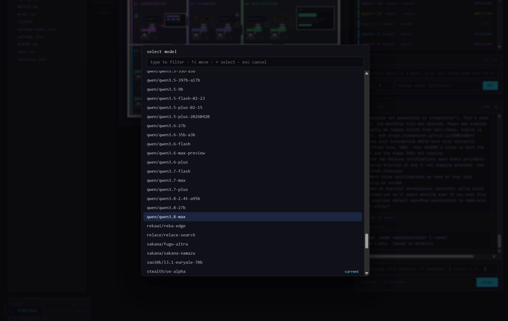

<!--
  banner gradient: cyan (#22d3ee) → indigo (#6366f1) → magenta (#d946ef),
  left-to-right across the wordmark
-->
```
  ██████╗ ███╗   ██╗ ██████╗ ███████╗██╗███████╗
 ██╔════╝ ████╗  ██║██╔═══██╗██╔════╝██║██╔════╝
 ██║  ███╗██╔██╗ ██║██║   ██║███████╗██║███████╗
 ██║   ██║██║╚██╗██║██║   ██║╚════██║██║╚════██║
 ╚██████╔╝██║ ╚████║╚██████╔╝███████║██║███████║
  ╚═════╝ ╚═╝  ╚═══╝ ╚═════╝ ╚══════╝╚═╝╚══════╝
```

# Your AI agents needed an office. So I built one.

Gnosis is a terminal coding agent that runs on any model, switches models
mid-session without losing your history, and ships with a browser UI where you
watch your agents work as blocky figures moving around a 3D office floor.

```sh
npx @dominquechurch/gnosis
```

[](https://github.com/DOMCHURCH/Gnosis/actions/workflows/ci.yml)
[](https://www.npmjs.com/package/@dominquechurch%2Fgnosis)
[](LICENSE)
[](https://openrouter.ai)

## See it



*Five lit rooms — coordinator, planning, coding, application, sub-agents.
Every agent, background job, and sub-agent is a figure at a desk, and the room
lights up when work lands there. Orbit it, zoom it, click a desk to read the
session. The floor above was staffed by typing "fill the office" into the chat
rail on the right — ask for agents and they walk in.*

**(GIF coming soon — run it yourself to see it live.)**

## Why this exists

Every other coding agent picks a model for you and locks the door behind it. I
wanted the opposite: start a session on Sonnet because it reasons well, notice
the task turned into a thousand mechanical edits, drop to DeepSeek mid-session
because it costs a fraction — and keep every message of the conversation. So
that is what Gnosis does. `/model`, pick a new one, keep going. Nothing
restarts, nothing is lost. The rest of it — the office floor, the phone UI, the
verifier that grades each turn — came from the same impulse: I wanted to *see*
what the agent was doing instead of scrolling a wall of text and hoping.

## What makes it different

| | Gnosis | Claude Code | Aider | OpenCode |
|---|---|---|---|---|
| Run any model you want | ✓ | ✗ | ✓ | ✓ |
| Swap models mid-session, keep history | ✓ | ✗ | ✗ | ✓ |
| Watch your agents work (browser UI) | ✓ | ✗ | ✗ | ✓ |
| A 3D office floor, because why not | ✓ | ✗ | ✗ | ✗ |
| Scan a QR code, drive it from your phone | ✓ | ✗ | ✗ | ✗ |
| Remembers things in your Obsidian vault | ✓ | ✗ | ✗ | ✗ |
| Plugs into MCP servers | ✓ | ✓ | ✗ | ✓ |
| Built by a 16-year-old | ✓ | ✗ | ✗ | ✗ |

## What it does

- **Any model via OpenRouter, switched at runtime** — `/model` mid-session, no
  restart, conversation history carries over intact
- **A 3D office floor** — a Three.js scene of five lit rooms you can orbit,
  showing every agent and sub-agent working in real time. Staff it from the chat:
  "add 5 agents to the coding floor", "fill the office", "clear the floor"
- **MCP client** — connect Context7, Playwright, Chrome DevTools, or any MCP server
- **Obsidian vault memory** — browse your vault and auto-save by intent into
  `Code/`, `Decisions/`, and `Research/`
- **Sub-agents with isolated context budgets** — parallel or scoped work on a
  restricted tool set, with per-sub-agent cost accounting
- **Tree-sitter repo map, PageRank-ranked** — the most central files first, so
  edits are grounded in the real shape of the codebase
- **Web terminal, file browser, diff viewer** — a real ConPTY shell in the
  browser and streaming diffs, not a read-only dashboard
- **Goal bar with an automated verifier loop** — hold an agent to a goal and a
  read-only reviewer checks each turn's diff and steers it back on a fail
- **Security scanning on every write** — API keys, tokens, and hardcoded
  passwords block the auto-commit before it happens
- **Phone-friendly** — scan the QR code, tap *Code it* or *Research it*, lock
  your screen, get a push notification when it needs you
- **12× cheaper on cached turns** — measured live: $0.0252 → $0.0021 on
  identical tokens via prompt-cache breakpoints
- **100 automated test suites** — offline, isolated, green on Windows CI every push


*Runtime model switching — the full OpenRouter catalog, in the browser*

## The story

I'm Dominique Church, I'm 16, and I wrote Gnosis in two weeks in Ottawa before
starting Grade 12. I wanted Claude Code without the vendor lock-in, and a
browser UI I could actually watch while agents worked. The office floor started
as a joke and turned into the thing everybody notices first.

## Install

Try it, no install needed:

```sh
npx @dominquechurch/gnosis
```

Keep it around:

```sh
npm install -g @dominquechurch/gnosis
echo "OPENROUTER_API_KEY=sk-or-..." >> ~/.dom/.env
gnosis
```

Then:

```sh
gnosis                       # the TUI
gnosis serve                 # the web UI — office floor, terminal, file browser
gnosis -p "prompt"           # one turn, answer to stdout, exit
```

`gnosis serve` prints a LOCAL and a LAN URL with a scannable QR code for the LAN
one. Point your phone's camera at it and you are driving the same session from
the couch.

Useful in-session: `/model` to switch models, `/serve` to open the web UI,
`/plan` to propose before editing, `/cost` for spend, `/undo` to revert the last
agent commit, `/rewind` (or double-Esc) to jump back a turn, `/map` for the repo
map. Type `@` to attach files, `/` to autocomplete.

## Keys

Your key never leaves your machine, and Gnosis does not phone home — no
telemetry, ever. Keys live in `~/.dom/.env`, are read at request time, and only
go to the service they belong to: `OPENROUTER_API_KEY` for model calls,
`BRAVE_API_KEY` for the `web_search` tool (optional), and `groqApiKey` in
`~/.dom/config.json` to route `groq/`-prefixed models natively (optional). The
`http` tool refuses loopback, private-network, and cloud-metadata addresses, and
secrets are referenced as `${VAR_NAME}` rather than inlined. Full details in
[SECURITY.md](SECURITY.md).

## Development

Want to contribute? The codebase is well-tested — 100 suites, all offline and
isolated — and the architecture is documented in
[CONTRIBUTING.md](CONTRIBUTING.md), along with test conventions and how to add
a skill.

```sh
git clone https://github.com/DOMCHURCH/Gnosis.git
cd Gnosis
npm install
npm run build
npm link
npm run verify      # 100 test suites
npm run eval        # 10-task eval harness
```

> Gnosis was formerly released as **dom**. The `dom` command still works as an
> alias, and `window.domOffice` is still there in the web UI.

---

MIT © 2026 Dominique Church · Built in Ottawa before Grade 12
