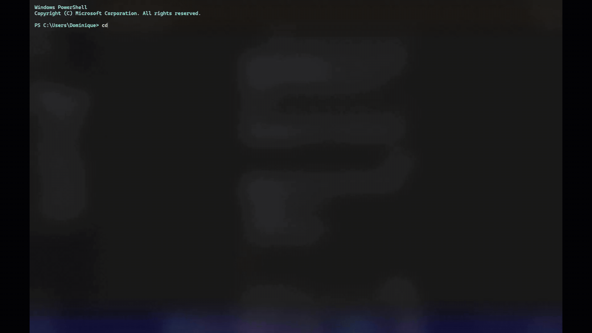

<div align="center">

# Gnosis

**Your AI agents needed an office. So I built one.**

[](https://github.com/DOMCHURCH/Gnosis/actions/workflows/ci.yml)
[](https://www.npmjs.com/package/@dominquechurch%2Fgnosis)
[](LICENSE)
[](https://openrouter.ai)

```sh
npx @dominquechurch/gnosis
```

Gnosis is a terminal coding agent that runs on any model, switches models
mid-session without losing your history, and ships with a browser UI where you
watch your agents work as blocky figures moving around a 3D office floor.

</div>

## Desktop App (recommended)

Download the installer for a native desktop experience — no terminal setup
required:

**[Download the latest Windows installer](https://github.com/DOMCHURCH/Gnosis/releases)**
— `Gnosis-Setup-1.1.0.exe`

The desktop app includes everything:

- The full browser UI with the Three.js office floor
- Integrated terminal panel
- Settings panel for API keys and config
- System tray with agent status indicator

It runs the same engine and the same web UI as `gnosis serve` — the window is
pointed at a local, token-gated server the app starts for itself, so nothing is
exposed that the CLI would not expose. Sessions open in `~/Gnosis`.

For CLI use, the npm package still works:

```sh
npm install -g @dominquechurch/gnosis
```

## See it

<div align="center">



*Five lit rooms — coordinator, planning, coding, application, sub-agents. Every
agent, background job, and sub-agent is a figure at a desk, and the room lights
up when work lands there. Orbit it, zoom it, click a desk to read the session.
The floor above was staffed by typing "fill the office" into the chat rail on
the right — ask for agents and they walk in.*

</div>

## Why this exists

Every other coding agent picks a model for you and locks the door behind it. I
wanted the opposite: start a session on Sonnet because it reasons well, notice
the task turned into a thousand mechanical edits, drop to DeepSeek mid-session
because it costs a fraction — and keep every message of the conversation. So
that is what Gnosis does. `/model`, pick a new one, keep going. Nothing
restarts, nothing is lost. The rest of it — the office floor, the phone UI, the
verifier that grades each turn — came from the same impulse: I wanted to *see*
what the agent was doing instead of scrolling a wall of text and hoping.

## What makes it different

| | Gnosis | Claude Code | Aider | OpenCode |
|---|---|---|---|---|
| Run any model you want | ✓ | ✗ | ✓ | ✓ |
| Swap models mid-session, keep history | ✓ | ✗ | ✗ | ✓ |
| Watch your agents work (browser UI) | ✓ | ✗ | ✗ | ✓ |
| Desktop app | ✓ | ✗ | ✗ | ✗ |
| A 3D office floor, because why not | ✓ | ✗ | ✗ | ✗ |
| Scan a QR code, drive it from your phone | ✓ | ✗ | ✗ | ✗ |
| Remembers things in your Obsidian vault | ✓ | ✗ | ✗ | ✗ |
| Plugs into MCP servers | ✓ | ✓ | ✗ | ✓ |
| Built by a 16-year-old | ✓ | ✗ | ✗ | ✗ |

## What it does

- **Native desktop app** — a Windows `.exe` installer that bundles the whole
  thing; no Node, no terminal, no setup beyond pasting a key
- **Built-in settings panel** — API keys and configuration from a window,
  written to `~/.dom/.env` without disturbing anything else already in it
- **System tray with agent status** — the icon reports idle or working at a
  glance, and closing the window leaves the agent running behind it
- **Any model via OpenRouter, switched at runtime** — `/model` mid-session, no
  restart, conversation history carries over intact
- **A 3D office floor** — a Three.js scene of five lit rooms you can orbit,
  replacing the flat SVG floor of 0.1.0. Every agent, background job, and
  sub-agent is a figure at a desk, in real time
- **Staff the floor by asking** — "add 5 agents to the coding floor", "fill the
  office", "clear the floor". Agents are placed on the free desks the floor
  actually has; you can also drop one on any desk by clicking it
- **Prompt caching** — 12× cheaper on cached turns, measured live: $0.0252 →
  $0.0021 on identical tokens via cache breakpoints
- **Sub-agents with isolated context budgets** — parallel or scoped work on a
  restricted tool set, with per-sub-agent cost accounting and explicit tool
  grants (a researcher can be handed `web_search`; nothing can be handed `bash`)
- **A coordinator, not a doer** — the system prompt holds the top-level agent to
  delegating and synthesizing, so independent work fans out instead of queueing
- **Goal bar with an automated verifier loop** — hold an agent to a goal and a
  read-only reviewer checks each turn's diff and steers it back on a fail
- **Automatic outcome evaluation** — after any turn that touched files, a
  read-only pass grades the diff pass/fail and can feed its own critique back as
  the next turn
- **`ask_user`** — the agent stops mid-task and asks, instead of guessing on a
  fork it cannot infer. Answer from the terminal or the browser; first one wins
- **Surgical rewind** — jump back to any earlier turn (double-Esc or `/rewind`),
  or summarize everything up to it into one block and keep going from there
- **Session memory that learns** — patterns and decisions distilled from past
  sessions are loaded at the start of the next one, so it walks in knowing what
  worked. Poisoned notes are refused and stripped, never replayed
- **Security scanning on every write** — API keys, tokens, and hardcoded
  passwords block the auto-commit before it happens
- **MCP client** — ships with Context7 (live library docs), Playwright (browser
  automation), and Chrome DevTools (live inspection); add any other server
- **Obsidian vault memory** — a vault panel in the browser, and auto-save that
  routes a turn worth keeping into `Code/`, `Decisions/`, or `Research/` by intent
- **Phone-first task assignment** — scan the QR code, tap *Code it* or *Research
  it*, lock your screen, get a push notification when it needs you
- **QR code LAN access, no flag** — `gnosis serve` always prints a LOCAL and a
  LAN URL with a scannable code; the token is the gate, not a setting
- **Web PTY terminal** — a real ConPTY shell in the browser, multiple tabs, each
  in the active session's cwd
- **File browser with `.domignore`** — browse the session's tree, attach a file
  to your next message, and keep noise out with gitignore syntax
- **Webhook inspector** — `POST /webhook/:label` is captured and shown in its own
  panel, so you can point a service at it and read what actually arrived
- **Kanban view** — every session as a card across ACTIVE / REVIEW / PARKED /
  DONE; moving a card changes the session (REVIEW puts it in plan mode)
- **Mobile responsive** — a real one-handed layout under 640px: bottom nav,
  bottom sheets for approvals, the floor as a tappable zone strip
- **Tree-sitter repo map, PageRank-ranked** — the most central files first, so
  edits are grounded in the real shape of the codebase
- **Streaming diffs** — a large edit writes progressively into a live diff viewer
  and only lands on disk at commit
- **101 automated test suites** — offline, isolated, green on Windows CI every push

<div align="center">


*Runtime model switching — the full OpenRouter catalog, in the browser*

</div>

## The story

I'm Dominique Church, I'm 16, and I built Gnosis over the summer before Grade 12
in Ottawa. I wanted Claude Code without the vendor lock-in, and a
browser UI I could actually watch while agents worked. The office floor started
as a joke and turned into the thing everybody notices first.

## CLI / Advanced

Try it, no install needed:

```sh
npx @dominquechurch/gnosis
```

Keep it around:

```sh
npm install -g @dominquechurch/gnosis
echo "OPENROUTER_API_KEY=sk-or-..." >> ~/.dom/.env
gnosis
```

Then:

```sh
gnosis                       # the TUI
gnosis serve                 # the web UI — office floor, terminal, file browser
gnosis -p "prompt"           # one turn, answer to stdout, exit
```

`gnosis serve` prints a LOCAL and a LAN URL with a scannable QR code for the LAN
one. Point your phone's camera at it and you are driving the same session from
the couch.

Useful in-session: `/model` to switch models, `/serve` to open the web UI,
`/plan` to propose before editing, `/cost` for spend, `/undo` to revert the last
agent commit, `/rewind` (or double-Esc) to jump back a turn, `/map` for the repo
map. Type `@` to attach files, `/` to autocomplete.

## Keys

Your key never leaves your machine, and Gnosis does not phone home — no
telemetry, ever. Keys live in `~/.dom/.env`, are read at request time, and only
go to the service they belong to: `OPENROUTER_API_KEY` for model calls,
`BRAVE_API_KEY` for the `web_search` tool (optional), and `groqApiKey` in
`~/.dom/config.json` to route `groq/`-prefixed models natively (optional). The
`http` tool refuses loopback, private-network, and cloud-metadata addresses, and
secrets are referenced as `${VAR_NAME}` rather than inlined. Full details in
[SECURITY.md](SECURITY.md).

## Development

Want to contribute? The codebase is well-tested — 101 suites, all offline and
isolated — and the architecture is documented in
[CONTRIBUTING.md](CONTRIBUTING.md), along with test conventions and how to add
a skill.

```sh
git clone https://github.com/DOMCHURCH/Gnosis.git
cd Gnosis
npm install
npm run build
npm link
npm run verify      # 101 test suites
npm run eval        # 10-task eval harness
```

> Gnosis was formerly released as **dom**. The `dom` command still works as an
> alias, and `window.domOffice` is still there in the web UI.

---

MIT © 2026 Dominique Church · Built in Ottawa before Grade 12
